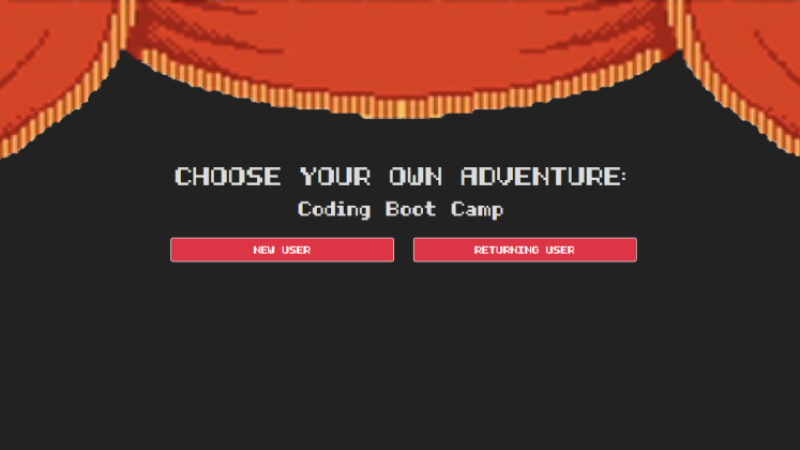
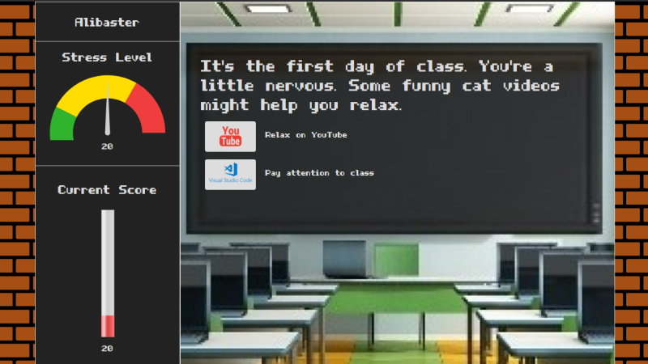
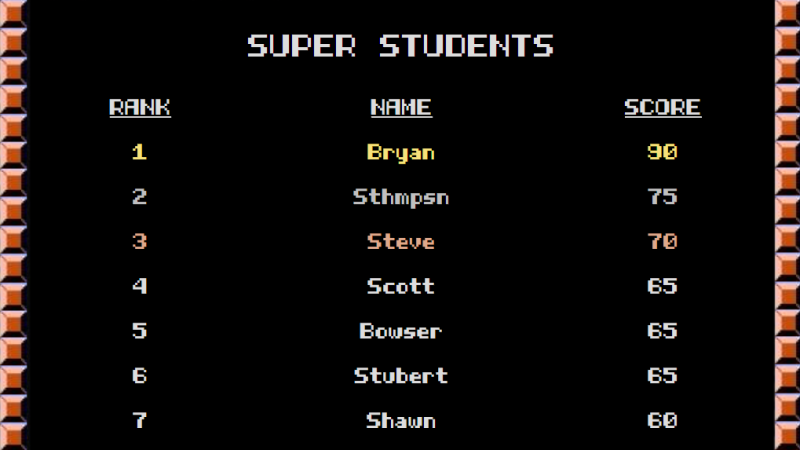

# Choose Your Own Adventure

Deployed App: [cyoa-bc.herokuapp.com](https://cyoa-bc.herokuapp.com)

## Project Description

This application is a Choose Your Own Adventure style game with a coding boot camp/academic theme.  The user creates an account complete with password and input validation.  The game consists of a series of questions, where the user's answer to the question would determine how their score and stress levels change, indicated by gauges.  When the game is over the score is logged to the MySQL database and a scoreboard showing the top 10 players is revealed.

## Technologies Used

* HTML, CSS, Bootstrap, Javascript, jQuery, Node.js, Express.js, Express-validate, Sequelize.js, bcryptjs, MySQL, Heroku, JawsDB, and Gauge.js

## Roles

* Scott (Project Manager, Concept, Back End)

* Bryan (Front End Design and Development, Media Responsiveness)

* Steve (Back End, Database)

* Ashlen (Front End Development, Back End)

* John (Back End, Database)

## Login Page

## Game Page

## Scoreboard

